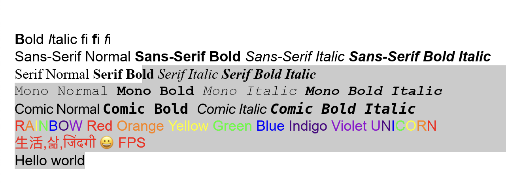

# bevy_cosmic_edit

This bevy plugin provides multiline text editing for bevy apps, thanks to [cosmic_text](https://github.com/pop-os/cosmic-text) crate!

Emoji, ligatures, and other fancy stuff is supported!



## Usage

⚠️ *Warning: This plugin is currently in early development, and its API is subject to change.*

Explore examples folder for basic usage.

Native:

```rust
cargo r --example font_per_widget
```

Wasm:

```rust
cargo install wasm-server-runner
RUSTFLAGS=--cfg=web_sys_unstable_apis cargo r --target wasm32-unknown-unknown --example basic_ui
```

## Compatibility

| bevy   | bevy_cosmic_edit |
| ------ | ---------------- |
| 0.15.0 | 0.26 - latest    |
| 0.14.0 | 0.21 - 0.25      |
| 0.13.0 | 0.16 - 0.20      |
| 0.12.* | 0.15             |
| 0.11.* | 0.8 - 0.14       |


## License

MIT or Apache-2.0
